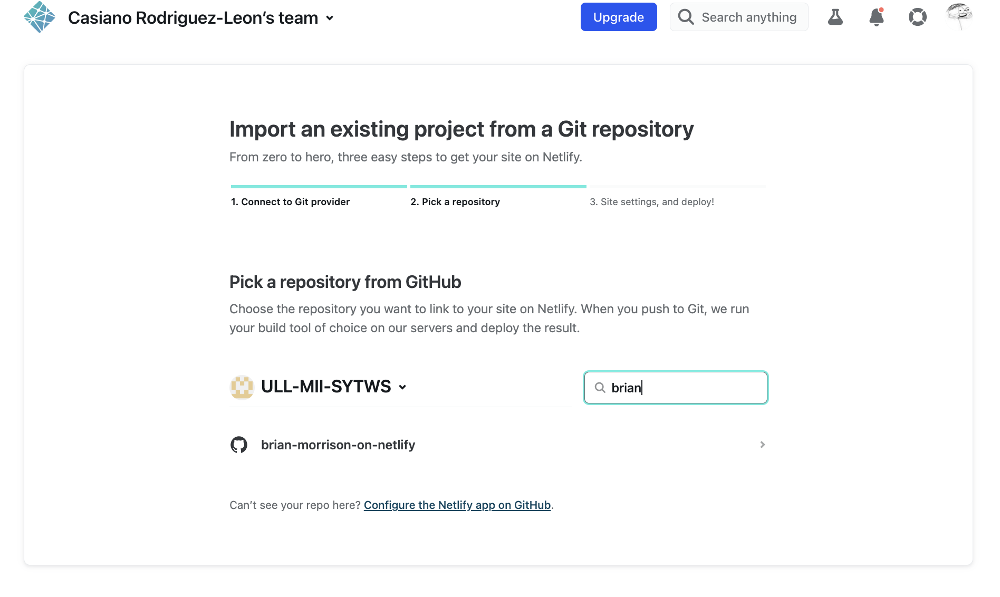
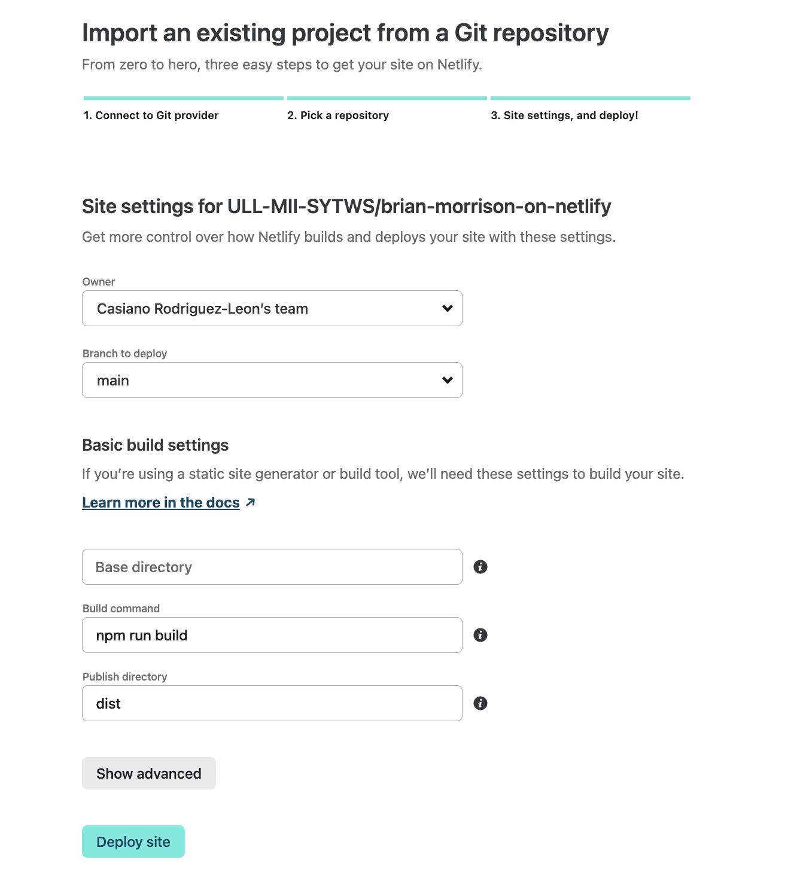
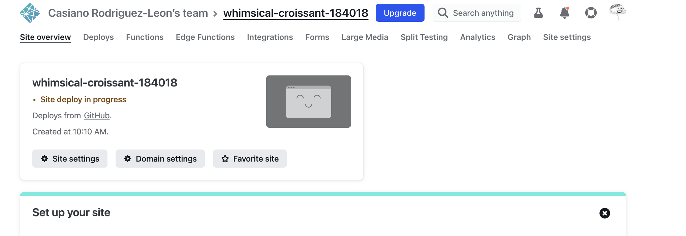
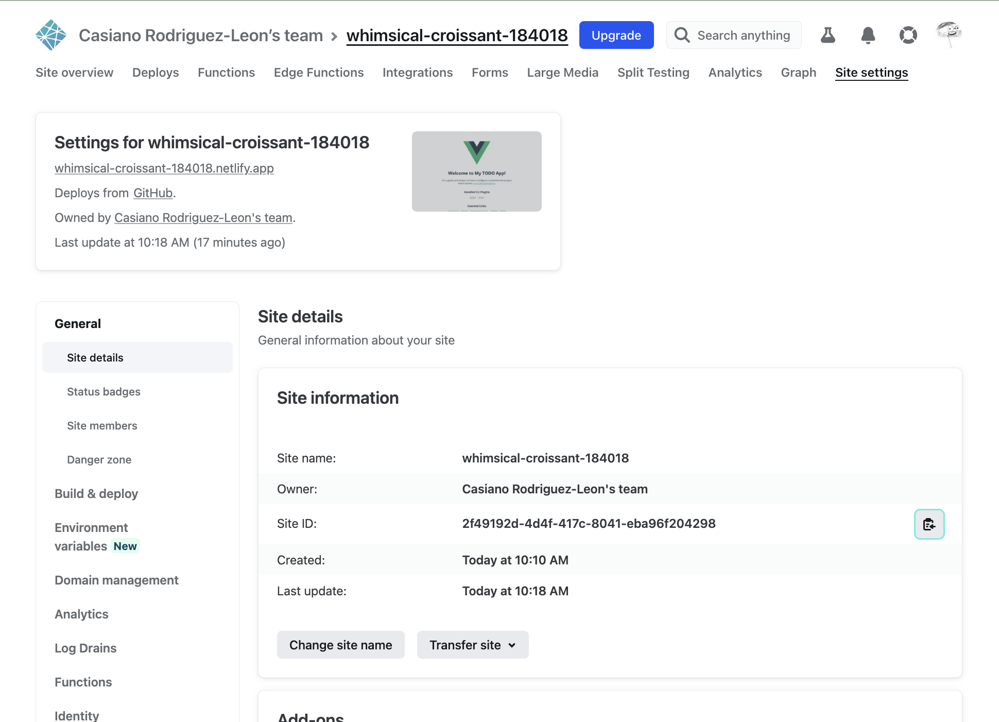
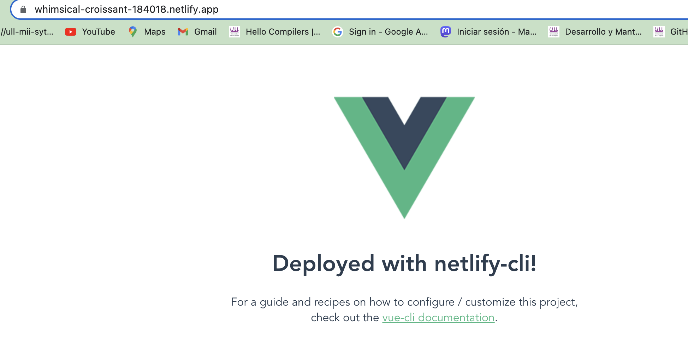

- [3 ways to deploy Web Apss to Netlify](#3-ways-to-deploy-web-apss-to-netlify)
  - [Install. Use node v16!](#install-use-node-v16)
  - ["vue create netlify-demo" and errors I committed during the installation](#vue-create-netlify-demo-and-errors-i-committed-during-the-installation)
    - [Errors I committed during the installation](#errors-i-committed-during-the-installation)
  - [Running in development mode](#running-in-development-mode)
  - [npm run build](#npm-run-build)
  - [Manually Deploying to Netlify](#manually-deploying-to-netlify)
  - [Deployment through GitHub](#deployment-through-github)
  - [Deployment using netlify-cli](#deployment-using-netlify-cli)
    - [Installing netlify-cli](#installing-netlify-cli)
    - [Login to netlify](#login-to-netlify)
    - [netlify link](#netlify-link)

# 3 ways to deploy Web Apss to Netlify

Main reference: 
* [3 ways to deploy Web Apss to Netlify](https://youtu.be/MEIMoz9pGRM) 2021
* [Video List](https://www.youtube.com/playlist?list=PLwpjN-4DtVRZfN1GgXCkCNVC9V711zKfg)


## Install. Use node v16!

```
three-ways-to-deploy npm i @vue/cli@4.5.9
 npm i @vue/cli@4.5.9
npm ERR! code EBADENGINE
npm ERR! engine Unsupported engine
➜  three-ways-to-deploy node --version
v18.8.0
➜  three-ways-to-deploy nvm use v16
Now using node v16.0.0 (npm v8.3.2)
➜  three-ways-to-deploy npm i @vue/cli@4.5.9
npm WARN deprecated source-map-url@0.4.1: See https://github.com/lydell/source-map-url#deprecated
# ... lots of deprecated ... messages
added 967 packages, and audited 989 packages in 12s
```

## "vue create netlify-demo" and errors I committed during the installation


```
➜  three-ways-to-deploy git:(main) vue create netlify-demo
```

Accept all defaults

### Errors I committed during the installation


**Am I running a global vue-cli or a local one?**

```
➜  three-ways-to-deploy git:(main) ✗ nvm use      
Found '/Users/casianorodriguezleon/campus-virtual/2223/learning/netlify-learning/brain-morrison-videos/three-ways-to-deploy/.nvmrc' with version <v16>
Now using node v16.0.0 (npm v8.3.2)
➜  three-ways-to-deploy git:(main) ✗ vue --version 
@vue/cli 4.5.15
➜  three-ways-to-deploy git:(main) ✗ npx vue --version
@vue/cli 4.5.9
```

Not much difference. I will continue with the global one:

```
➜  three-ways-to-deploy git:(main) ✗ npm uninstall  @vue/cli@4.5.9
```

## Running in development mode

```
➜  three-ways-to-deploy git:(main) ✗ cd netlify-demo 
➜  netlify-demo git:(main) ✗ npm run serve

> netlify-demo@0.1.0 serve
> vue-cli-service serve

 INFO  Starting development server...
98% after emitting CopyPlugin

 DONE  Compiled successfully in 2341ms                                                        9:19:23


  App running at:
  - Local:   http://localhost:8081/ 
  - Network: http://192.168.1.235:8081/

  Note that the development build is not optimized.
  To create a production build, run npm run build.
  ```

  Everything is working fine. I can see the app in the browser.

  ## npm run build

  ```
  ➜  netlify-demo git:(main) ✗ npm run build

> netlify-demo@0.1.0 build
> vue-cli-service build


⠴  Building for production...

 DONE  Compiled successfully in 3968ms                                                        9:21:30

  File                                 Size                          Gzipped

  dist/js/chunk-vendors.caf87120.js    70.67 KiB                     25.41 KiB
  dist/js/app.80f58bf0.js              4.40 KiB                      1.59 KiB
  dist/css/app.fb0c6e1c.css            0.33 KiB                      0.23 KiB

  Images and other types of assets omitted.

 DONE  Build complete. The dist directory is ready to be deployed.
 INFO  Check out deployment instructions at https://cli.vuejs.org/guide/deployment.html
 ``` 

## Manually Deploying to Netlify

**Minutes**: 3:17

1. Go to [Netlify](https://www.netlify.com/) and create an account.
2. Then visit **Team overview > Sites** and go to the end  of the menu


In the terminal open your file explorer:
  
```
➜  netlify-demo open .
``` 

and drag and drop the `dist` folder to the browser.


## Deployment through GitHub

**Minutes**: 4:05

```
➜  netlify-demo git init .
Inicializado repositorio Git vacío en /Users/casianorodriguezleon/campus-virtual/2223/learning/netlify-learning/brain-morrison-videos/three-ways-to-deploy/netlify-demo/.git/
➜  netlify-demo git:(main) ✗ git status
En la rama main

No hay commits todavía

Archivos sin seguimiento:
  (usa "git add <archivo>..." para incluirlo a lo que será confirmado)
        .gitignore
        .nvmrc
        README.md
        babel.config.js
        docs/
        package-lock.json
        package.json
        public/
        src/

no hay nada agregado al commit pero hay archivos sin seguimiento presentes (usa "git add" para hacerles seguimiento)
➜  netlify-demo git:(main) ✗ git add .
➜  netlify-demo git:(main) ✗ git ci -am 'reparing for deploy to netlify' 
[main (commit-raíz) 213b6bc] reparing for deploy to netlify
 14 files changed, 28800 insertions(+)
 create mode 100644 .gitignore
 create mode 100644 .nvmrc
 create mode 100644 README.md
 create mode 100644 babel.config.js
 create mode 100644 docs/images/manually-installing-1.png
 create mode 100644 docs/images/manually-installing-2.png
 create mode 100644 package-lock.json
 create mode 100644 package.json
 create mode 100644 public/favicon.ico
 create mode 100644 public/index.html
 create mode 100644 src/App.vue
 create mode 100644 src/assets/logo.png
 create mode 100644 src/components/HelloWorld.vue
 create mode 100644 src/main.js
➜  netlify-demo git:(main) gh repo create
? What would you like to do? Push an existing local repository to GitHub
? Path to local repository .
? Repository name ULL-MII-SYTWS/brian-morrison-on-netlify
? Description https://youtu.be/MEIMoz9pGRM
? Visibility Public
✓ Created repository ULL-MII-SYTWS/brian-morrison-on-netlify on GitHub
? Add a remote? Yes
? What should the new remote be called? origin
✓ Added remote git@github.com:ULL-MII-SYTWS/brian-morrison-on-netlify.git
? Would you like to push commits from the current branch to "origin"? Yes
Enumerando objetos: 22, listo.
Contando objetos: 100% (22/22), listo.
Compresión delta usando hasta 8 hilos
Comprimiendo objetos: 100% (18/18), listo.
Escribiendo objetos: 100% (22/22), 579.60 KiB | 4.17 MiB/s, listo.
Total 22 (delta 0), reusados 0 (delta 0), pack-reusados 0
To github.com:ULL-MII-SYTWS/brian-morrison-on-netlify.git
 * [new branch]      HEAD -> main
rama 'main' configurada para rastrear 'origin/main'.
✓ Pushed commits to git@github.com:ULL-MII-SYTWS/brian-morrison-on-netlify.git
```







Now if you make some changes and push them to GitHub the changes will be deployed automatically.

## Deployment using netlify-cli

**Minutes**: 8:30

### Installing netlify-cli

 I have already a netlify-cli installed in my node version 16:

 ```
 ➜  netlify-demo git:(main) npm ls netlify-cli -g
/Users/casianorodriguezleon/.nvm/versions/node/v16.0.0/lib
└── netlify-cli@12.12.0
```

However in the video appears that Morrison installs  version `3.13.0`. I will continue with the version 12.

```
➜  netlify-demo git:(main) ✗ netlify

⬥ Netlify CLI
Read the docs: https://docs.netlify.com/cli/get-started/
Support and bugs: https://github.com/netlify/cli/issues

VERSION
  netlify-cli/12.12.0 darwin-x64 node-v16.0.0

USAGE
  $ netlify [COMMAND]

COMMANDS
  $ addons       (Beta) Manage Netlify Add-ons
  $ api          Run any Netlify API method
  $ build        (Beta) Build on your local machine
  $ completion   (Beta) Generate shell completion script
  $ deploy       Create a new deploy from the contents of a folder
  $ dev          Local dev server
  $ env          Control environment variables for the current site
  $ functions    Manage netlify functions
  $ recipes      (Beta) Create and modify files in a project using
                 pre-defined recipes
  $ graph        (Beta) Control the Netlify Graph functions for the
                 current site
  $ init         Configure continuous deployment for a new or existing
                 site. To create a new site without continuous deployment, use `netlify
                 sites:create`
  $ link         Link a local repo or project folder to an existing site
                 on Netlify
  $ lm           Handle Netlify Large Media operations
  $ login        Login to your Netlify account
  $ open         Open settings for the site linked to the current
                 folder
  $ serve        (Beta) Build the site for production and serve locally.
                 This does not watch the code for changes, so if you need to rebuild your site then
                 you must exit and run `serve` again.
  $ sites        Handle various site operations
  $ status       Print status information
  $ switch       Switch your active Netlify account
  $ unlink       Unlink a local folder from a Netlify site
  $ watch        Watch for site deploy to finish
```

### Login to netlify

Let us login:
  
```   
➜  netlify-demo git:(main) ✗ netlify login
Already logged in via netlify config on your machine

Run netlify status for account details

or run netlify switch to switch accounts

To see all available commands run: netlify help


   ╭─────────────────────────────────────────╮
   │                                         │
   │   Update available 12.12.0 → 12.13.1    │
   │   Run npm i -g netlify-cli to update    │
   │                                         │
   ╰─────────────────────────────────────────╯
```
Following the advice we update the netlify-cli.

### netlify link

netlify link links a local folder to a site on Netlify. It creates a `.netlify` folder in the local folder with a `state.json` file that contains the site id. It also creates a `netlify.toml` file with the build settings.

```
➜  netlify-demo git:(main) ✗ netlify link --help
Link a local repo or project folder to an existing site on Netlify

USAGE
  $ netlify link [options]

OPTIONS
  --git-remote-name <name>                     Name of Git remote to use. e.g. "origin"
  -h, --help                                   display help for command
  --id <id>                                    ID of site to link to
  --debug                                      Print debugging information
  --http-proxy [address]                       Proxy server address to route requests
                                               through.
  --http-proxy-certificate-filename [file]     Certificate file to use when connecting using a
                                               proxy server
  --name <name>                                Name of site to link to

EXAMPLES
  $ netlify link
  $ netlify link --id 123-123-123-123
  $ netlify link --name my-site-name
```

In netlify go to the **site overview > site settings > general** and copy the site id.



The I run:

```
➜  netlify-demo git:(main) ✗ netlify link --id 2f49192d-4d4f-417c-8041-eba96f204298

Adding local .netlify folder to .gitignore file...
Linked to whimsical-croissant-184018
```

Make a change to the `App.vue` and rebuild the distribution:

```
➜  netlify-demo git:(main) ✗ npm run build
```
and now we can deploy it with `netlify deploy`:

```
➜  netlify-demo git:(main) ✗ netlify deploy --help
Create a new deploy from the contents of a folder

USAGE
  $ netlify deploy [options]

OPTIONS
  --alias <name>                               Specifies the alias for deployment, the string
                                               at the beginning of the deploy subdomain. Useful for
                                               creating predictable deployment URLs. Avoid setting
                                               an alias string to the same value as a deployed
                                               branch. `alias` doesn’t create a branch deploy and
                                               can’t be used in conjunction with the branch
                                               subdomain feature. Maximum 37 characters.
  -a, --auth <token>                           Netlify auth token to deploy with
  -b, --branch <name>                          Serves the same functionality as --alias.
                                               Deprecated and will be removed in future
                                               versions
  --build                                      Run build command before deploying
  --context <context>                          Context to use when resolving build
                                               configuration
  -d, --dir <path>                             Specify a folder to deploy
  -f, --functions <folder>                     Specify a functions folder to deploy
  -h, --help                                   display help for command
  --json                                       Output deployment data as JSON
  -m, --message <message>                      A short message to include in the deploy
                                               log
  -o, --open                                   Open site after deploy (default: false)
  -p, --prod                                   Deploy to production (default: false)
  --prod-if-unlocked                           Deploy to production if unlocked, create a draft
                                               otherwise (default: false)
  -s, --site <name-or-id>                      A site name or ID to deploy to
  --skip-functions-cache                       Ignore any functions created as part of a
                                               previous `build` or `deploy` commands, forcing them
                                               to be bundled again as part of the deployment
                                               (default: false)
  --timeout <number>                           Timeout to wait for deployment to finish
  --debug                                      Print debugging information
  --http-proxy [address]                       Proxy server address to route requests
                                               through.
  --http-proxy-certificate-filename [file]     Certificate file to use when connecting using a
                                               proxy server
  --trigger                                    Trigger a new build of your site on Netlify
                                               without uploading local files

EXAMPLES
  $ netlify deploy
  $ netlify deploy --site my-first-site
  $ netlify deploy --prod
  $ netlify deploy --prod --open
  $ netlify deploy --prod-if-unlocked
  $ netlify deploy --message "A message with an $ENV_VAR"
  $ netlify deploy --auth $NETLIFY_AUTH_TOKEN
  $ netlify deploy --trigger
  $ netlify deploy --build --context deploy-preview
```

Let us run it:

```
➜  netlify-demo git:(main) ✗ netlify deploy --prod
Deploy path: /Users/casianorodriguezleon/campus-virtual/2223/learning/netlify-learning/brain-morrison-videos/three-ways-to-deploy/netlify-demo/dist
Deploying to main site URL...
✔ Finished hashing 
✔ CDN requesting 3 files
✔ Finished uploading 3 assets
✔ Deploy is live!

Logs:              https://app.netlify.com/sites/whimsical-croissant-184018/deploys/63f1fe3039e9554f883f5a6f
Unique Deploy URL: https://63f1fe3039e9554f883f5a6f--whimsical-croissant-184018.netlify.app
Website URL:       https://whimsical-croissant-184018.netlify.app
```

