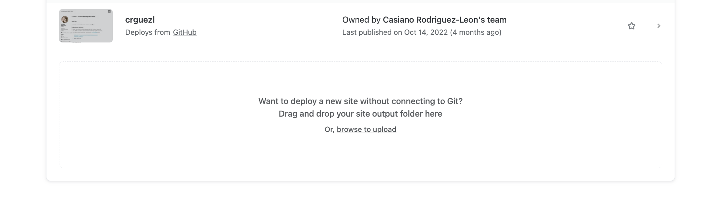
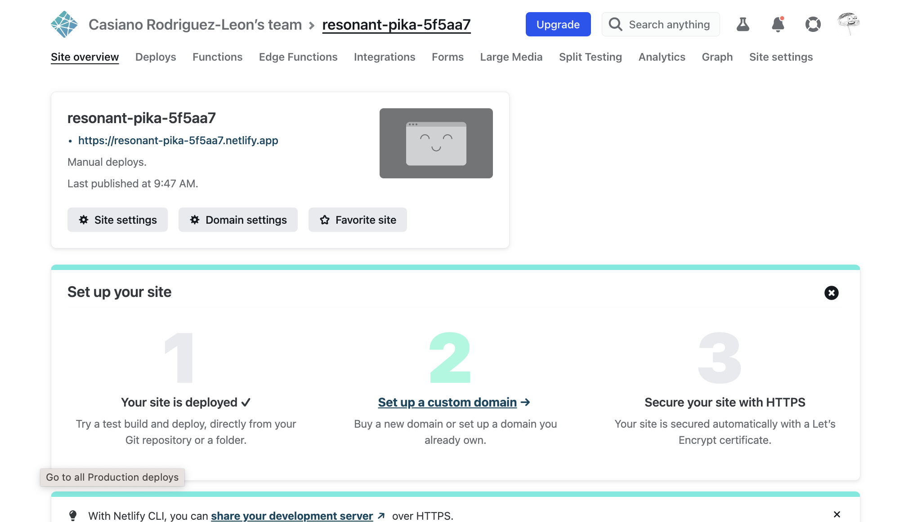

# 3 ways to deploy Web Apss to Netlify

Main reference: [3 ways to deploy Web Apss to Netlify](https://youtu.be/MEIMoz9pGRM) 2021

## Install. Use node v16!

```
three-ways-to-deploy npm i @vue/cli@4.5.9
 npm i @vue/cli@4.5.9
npm ERR! code EBADENGINE
npm ERR! engine Unsupported engine
➜  three-ways-to-deploy node --version
v18.8.0
➜  three-ways-to-deploy nvm use v16
Now using node v16.0.0 (npm v8.3.2)
➜  three-ways-to-deploy npm i @vue/cli@4.5.9
npm WARN deprecated source-map-url@0.4.1: See https://github.com/lydell/source-map-url#deprecated
# ... lots of deprecated ... messages
added 967 packages, and audited 989 packages in 12s
```

## "vue create netlify-demo" and errors I committed during the installation


```
➜  three-ways-to-deploy git:(main) vue create netlify-demo
```

Accept all defaults

### Errors I committed during the installation


**Am I running a global vue-cli or a local one?**

```
➜  three-ways-to-deploy git:(main) ✗ nvm use      
Found '/Users/casianorodriguezleon/campus-virtual/2223/learning/netlify-learning/brain-morrison-videos/three-ways-to-deploy/.nvmrc' with version <v16>
Now using node v16.0.0 (npm v8.3.2)
➜  three-ways-to-deploy git:(main) ✗ vue --version 
@vue/cli 4.5.15
➜  three-ways-to-deploy git:(main) ✗ npx vue --version
@vue/cli 4.5.9
```

Not much difference. I will continue with the global one:

```
➜  three-ways-to-deploy git:(main) ✗ npm uninstall  @vue/cli@4.5.9
```

## Running in development mode

```
➜  three-ways-to-deploy git:(main) ✗ cd netlify-demo 
➜  netlify-demo git:(main) ✗ npm run serve

> netlify-demo@0.1.0 serve
> vue-cli-service serve

 INFO  Starting development server...
98% after emitting CopyPlugin

 DONE  Compiled successfully in 2341ms                                                        9:19:23


  App running at:
  - Local:   http://localhost:8081/ 
  - Network: http://192.168.1.235:8081/

  Note that the development build is not optimized.
  To create a production build, run npm run build.
  ```

  Everything is working fine. I can see the app in the browser.

  ## npm run build

  ```
  ➜  netlify-demo git:(main) ✗ npm run build

> netlify-demo@0.1.0 build
> vue-cli-service build


⠴  Building for production...

 DONE  Compiled successfully in 3968ms                                                        9:21:30

  File                                 Size                          Gzipped

  dist/js/chunk-vendors.caf87120.js    70.67 KiB                     25.41 KiB
  dist/js/app.80f58bf0.js              4.40 KiB                      1.59 KiB
  dist/css/app.fb0c6e1c.css            0.33 KiB                      0.23 KiB

  Images and other types of assets omitted.

 DONE  Build complete. The dist directory is ready to be deployed.
 INFO  Check out deployment instructions at https://cli.vuejs.org/guide/deployment.html
 ``` 

## Manually Deploying to Netlify

**Minutes**: 3:17

1. Go to [Netlify](https://www.netlify.com/) and create an account.
2. Then visit **Team overview > Sites** and go to the end  of the menu



In the terminal open your file explorer:
  
```
➜  netlify-demo open .
``` 

and drag and drop the `dist` folder to the browser.



## Deployment through GitHub

**Minutes**: 4:05

